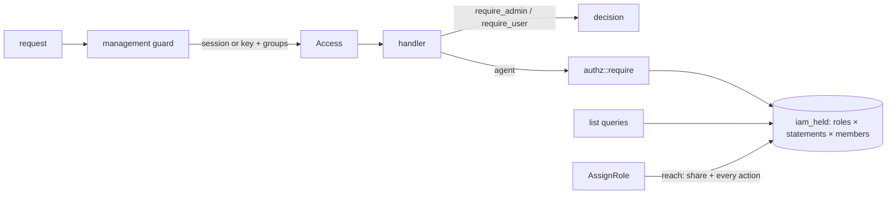

# ADR-0009: Management authorization by roles of actions on agents

Status: Accepted

## In brief

- Management callers are authorized per agent through roles, AWS style: a role is a named
  set of statements, each an action on one agent or on every agent, and a user, group or
  API key holds any number of roles. Actions (`view`, `edit`, `deploy`, `share`) do not
  imply each other; a role states everything it gives.
- Every agent is created with three system roles that are never edited: reader, editor and
  deployer. Installation-wide roles over every agent are seeded and assigned by
  administrators only. Administrators hold everything.
- Assigning a role is bounded by reach: the caller must hold `share` on each agent the role
  names and every action it gives there.
- Connections and identities carry no roles; they are reached by any signed-in caller and
  follow the agent where an agent is involved.
- One statement table, one membership table, one SQL function and one Rust check.
- API keys hold roles exactly as users do, but join no groups, never administer, and never
  manage access. Every management RPC applies its own rule; there is no central table.
- This amends [ADR-0003](0003-deployment-authentication.md), which left the engine
  without a membership model. Agent runtime, sidecar and ingress authentication are
  unchanged.

## Context

Every user admitted by the OIDC provider, and every management API key, had full
authority over every agent. Installations need to decide who may view and who may
change an agent, with administrators above that, and the same question will be asked
of connections, tools and later kinds, and will need actions beyond read and write, such
as deploying or approving on an agent. The design keeps the hosted API's visibility and
ownership pair as the two actions every kind has, so both products share vocabulary and
wire shape, adapted to an engine that has no organizations or teams.

## Decision

This model governs the control plane only: management RPCs reached with a browser
session or an API key. The agent runtime listener (runtime RPCs, `/v1/traces`,
`/v1/logs`, `/v1/metrics`, invocation controls) never consults it. Those paths are
authorized solely by the invocation or deployment token the engine issued, which names
one agent, and restricted functions check the agent's capabilities. Management
credentials are refused there, and invocation tokens are refused on the control plane.

Groups are the only role mechanism; there is no permission catalogue. A group id's
prefix names who owns its membership: `tilde_system:` is built in, `external:` mirrors the
identity provider's group claim and is reconciled at login, `local:` is managed by
administrators and never touched by login. A claimed name is normalised behind `external:`
and therefore can never name a system or local group. Authorization reads memberships
from the database on every request, not from the token.

Actions belong to the agent kind and are independent: `view`, `edit`, `deploy` and
`share`. A role bundles them: `iam_roles` names it, `iam_role_statements` lists its
(resource, action) pairs, `iam_role_members` records who holds it. Every agent gets
`agent/<id>/reader` (`view`), `agent/<id>/editor` (`view`, `edit`, `share`) and
`agent/<id>/deployer` (`view`, `deploy`, `share`) in the transaction that creates it, and
its creator holds editor and deployer. `agents/reader`, `agents/editor` and
`agents/deployer` are seeded with statements on the nil resource id, which `iam_held`
matches for any agent, so they cover agents created later. Roles are not user-editable in
this iteration; more statements can be stacked under a role later without changing the
model. The SQL function `iam_held` answers "does the caller hold any of these actions on
this agent through some role"; handlers call `authz::require(resource, action)` and list
queries call `iam_held` with `view` in their `WHERE` clause so invisible rows never reach a
page. An agent the caller cannot view is reported as not found. Resources without roles of
their own are checked against their agent, and an operation on two agents is two checks.

Reach bounds sharing: to assign or revoke a role the caller must hold `share` on every
agent the role names and every action the role gives there. Editors therefore hand out
reader and editor, deployers reader and deployer, and only administrators the
installation-wide roles. Connections carry no roles: they are an internal primitive that
agents use, so anyone signed in may list and manage them, and attaching one needs `edit`
on the agent. Identities and identity budgets follow: any caller, or administrators for
installation-wide budgets.

There is no central policy table: the guard only authenticates, and every handler applies
its own rule, so the rule sits next to the code it protects. A test reads every RPC from
the contracts and drives each through the guard as an anonymous caller, a plain user and
an API key, so an RPC without a rule fails the build.

Departures from the hosted API, each because the engine differs:

- Independent actions bundled by roles rather than an ordered plane. A deployer should not
  edit settings and an editor should not deploy, which an order cannot express; roles say
  exactly what they give, and a later role can stack more statements without touching the
  vocabulary.
- There are no per-resource `team`/`private` mode columns. Without tenants, "everyone"
  is the reader role given to `tilde_system:user`, leaving one mechanism and one predicate.
- One statement table instead of one per kind. The engine has a single database, so a
  shared table gives one set of queries and one share dialog. Kinds purge their roles
  where they delete.
- "All agents" is a statement on the nil resource id, matched by `iam_held` for any
  target. It gives read-all, edit-all and deploy-all without full administration and
  covers agents created later. Only administrators assign these.
- API keys do not act as their creator, so automation outlives the person who set it
  up, and they join no groups, so sharing something new with a group never widens a
  long-lived bearer secret. They hold roles directly, limited at creation to the
  creator's reach. Access, user, group and key management refuse keys, so nothing a key
  holds can become administration.
- Any signed-in user may create agents and owns what they create; there is no creator
  role. A key creates only when it edits every agent.
- Connections and identities have no roles: they are lower-level primitives an agent uses,
  and the agent's roles govern what matters.

## Consequences

Adding a kind is a `Kind` variant, its actions and system roles, a constraint value,
`require` calls and one list predicate; no schema redesign. Capabilities remain the separate axis for what
an agent may do, bounded for non-administrator owners by what they hold themselves so
an owner cannot mint reach through their agent.

Provider group changes reach a user at their next login, at most one session lifetime
later; administrators can revoke a user's sessions sooner. Providers that omit groups
from the ID token are not yet supported through the userinfo endpoint.

Migration keeps every existing user an administrator, since that is the authority they
had. Existing keys hold no roles until given some. On a new installation the first user to sign in becomes an
administrator; operators who prefer the provider to decide set
`ENGINE_OIDC_ADMIN_GROUPS`, after which administrator membership follows the provider
at every login.

Approval counts, author separation and similar deployment rules are workflow state on
the deployment, not roles; IAM answers only whether the caller holds the action.

Rejected: a single action per grant with an implication chain, which cannot express a
deployer who does not edit; a single ordered plane per resource, for the same reason; a policy engine such as Cedar, which cannot filter lists and
would host what is still a lookup table; compile-time permit tokens on domain services, because runtime and background
callers share those services and would each need an escape hatch; trusting the token's
group claim per request, which would make local membership changes wait for re-login.
