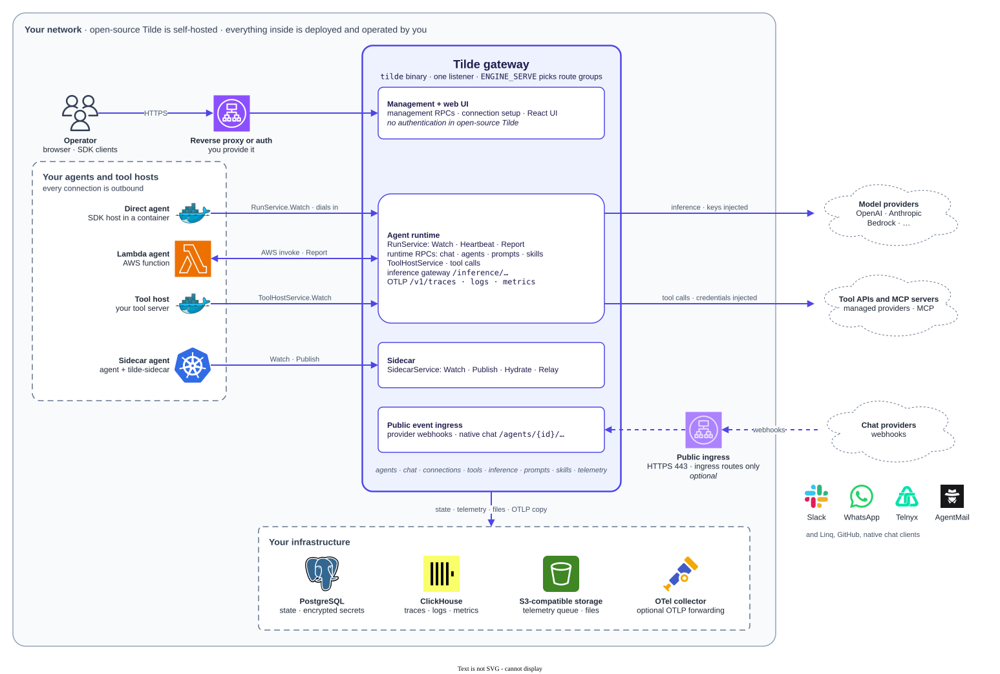

# Architecture

Tilde is a harness for AI agents. It runs everything around an agent: the registry,
chat channels, credentials, tools, model access, prompts, skills and telemetry. Agents
are written in any language or framework and connect to Tilde through an SDK
(`sdk/ts`, `sdk/py`).

The diagram source is `docs/assets/architecture.drawio`. See
[code structure](code-structure.md) for where each part lives and
[patterns](patterns.md) for the rules to follow when changing it. Domain terms are
defined in `CONTEXT.md`.

## The gateway

The gateway is one Rust binary, `tilde` (`crates/tilde/src/bin/tilde/main.rs`). It
serves every route group on a single listener (`ENGINE_LISTEN`, default
`127.0.0.1:8080`). `ENGINE_SERVE` (or `--serve`) chooses which groups a process
mounts: `management`, `runtime`, `ingress`, `sidecar`, or `all` (the default).
Operators who want network isolation run separate processes per group. The routers
are composed in `crates/tilde/src/iam/listeners.rs`.

| Route group | Serves | Authentication |
| --- | --- | --- |
| Management | Management ConnectRPC services, connection setup and OAuth callbacks, trace and log viewers, and the React UI when built with `--features embedded-web` | None in open-source Tilde |
| Runtime | `tilde.run.v1.RunService`, runtime RPCs, tool hosts, the inference gateway, OTLP `/v1/traces`, `/v1/logs`, `/v1/metrics` | Deployment tokens, signed invocation tokens, tool host tokens |
| Ingress | Provider webhooks (`/connections/webhooks/{connection_id}`) and native chat (`/agents/{agent}/...`) | Provider signatures or scoped chat tokens |
| Sidecar | `tilde.agent_event_ingress.v1.SidecarService` | Sidecar deployment tokens |

`/healthz` and `/readyz` are always mounted.

The management group has no authentication in open-source Tilde. Every caller can do
everything. Operators must put a reverse proxy or another authentication method in
front of it. The other groups check their own tokens and signatures.

Binding to a non-loopback address requires `--allow-network` or
`ENGINE_ALLOW_NETWORK=true`. Browser origins are checked against `ENGINE_WEB_ORIGINS`
and the configured public URLs (`crates/tilde/src/network.rs`).

The gateway also runs background workers: sidecar relay and recovery, connection
setup cleanup, agent health, inference usage and budgets, price refresh, skill syncs,
MCP health, and telemetry delivery.

## Agents and the run protocol

Agents never listen. An agent host dials in to the gateway with a deployment token
and opens `RunService.Watch`. The gateway delivers each invocation (`InvokeRequest`)
as a frame on that stream. The host reports acceptance, reasoning and the end of the
invocation through `RunService.Report`, and sends readiness with `Heartbeat`.

Each invocation gets a short-lived signed token scoped to one agent, invocation, run
and thread, with a capability snapshot. The SDK uses it for runtime RPCs, inference
and telemetry uploads, and renews it while the invocation runs.

An agent has many deployments (`agent_deployments`), each with an execution type:

- Gateway: an SDK host (`connectAgent` in TypeScript) dials the gateway runtime
  directly.
- Sidecar: the agent process dials a local `tilde-sidecar`, which dials the gateway.
- Lambda: the gateway invokes the function asynchronously through the AWS API. The
  function reports back through `RunService.Report`.

Processes that dial in with a deployment token are recorded as `agent_instances`.
Routing (latest or weighted) picks a deployment per new conversation and pins it.
Deployment code is in `crates/tilde/src/deployment/`.

## Sidecars

`tilde-sidecar` (`crates/tilde/src/bin/tilde-sidecar/main.rs`,
`crates/tilde/src/deployment/sidecar.rs`) runs beside agent processes. It accepts one
Sidecar deployment token per agent (`ENGINE_SIDECAR_AGENT_TOKENS`) and keeps no state
on disk.

- A loopback runtime listener (`ENGINE_SIDECAR_RUNTIME_LISTEN`, default
  `127.0.0.1:8081`) serves the agent process next to it.
- A network listener (`ENGINE_SIDECAR_LISTEN`, default `0.0.0.0:8082`) serves
  provider webhooks and native ingress.
- Everything else is outbound to the gateway's sidecar group: a held `Watch` stream
  for configuration, leases and directives, and `Publish` calls for heartbeats,
  events and telemetry.

PostgreSQL stays the record. A replica caches the threads it holds a lease on
(`thread_leases`), executes them, and ships events to the gateway asynchronously.
Replicas never call each other, and the gateway never calls a replica. Run
`task dev:sidecar` to start one locally.

## Chat providers and channels

Chat (`crates/tilde/src/chat/`) owns threads, participants, messages, runs,
invocations, goals and tasks. Providers are in `crates/tilde/src/chat/providers/`:
Slack, GitHub, AgentMail, Linq, WhatsApp (Meta or Telnyx) and the native Tilde
provider. A channel is a connection with the `channel` capability assigned to an
agent. Webhooks arrive on the ingress group. Each adapter verifies its provider's
signature. Replies are ordinary tools, such as `sendMessage`, that call the provider's
API.

The native Tilde provider exposes `tilde.provider.tilde.v1.ChatService` at
`/agents/{agentId}/...`. Apps use it through `@trytilde/chat-ui`,
`@trytilde/chat-proxy` and `@trytilde/chat-next`.

## Connections and credentials

A connection (`crates/tilde/src/connections/`) is a set of credentials for a third
party API. A connection type declares its capabilities: `channel`, `inference` or
`tool`. Built-in providers are defined in `crates/tilde/src/connections/catalog/`.
Custom providers can declare static fields or standard OAuth at runtime. Setup runs
in a sandboxed iframe authorised by a short-lived connection setup token.

Credentials, OAuth tokens and signing keys are encrypted before they reach
PostgreSQL. The encryption module (`crates/tilde/src/encryption.rs`) uses AES-256-GCM
with a data key protected by a seed (`ENGINE_ENCRYPTION_KEY`) or AWS KMS
(`ENGINE_ENCRYPTION_BACKEND=aws-kms`). Each ciphertext is bound to its record and
field. Agents never receive provider credentials: the gateway injects them into
upstream requests.

## Inference gateway

Agents call model providers through `/inference/{provider}/{account}/{*rest}` on the
runtime listener of the gateway or a sidecar, in each provider's native wire format.
The route checks the invocation token, removes the SDK's placeholder credential,
injects the real key or SigV4 signature, and streams bytes both ways. Usage and cost
are recorded off the request path in `inference_requests`, priced from
`inference_prices`. Budgets are enforced when invocation tokens are issued and
renewed. Code is in `crates/tilde/src/inference/`.

## Tools

Tool sources are in `crates/tilde/src/tools/`:

- Managed tool providers (`tools/providers/<id>`): tools shipped with Tilde and
  backed by a connection's credentials, such as Tavily, Google Workspace, Sentry,
  GitHub, Slack, Stripe, E2B, Modal and AWS.
- MCP servers (`tools/mcp.rs`, `tools/mcp_catalog.rs`): a connection type can serve
  its tools from an MCP server over streamable HTTP. Curated servers are built in.
  Other servers are added by URL.
- Tool hosts (`tools/hosts.rs`): customer tool servers built with
  `@trytilde/sdk/tool-host` or the Python SDK. A connected host dials
  `tilde.tool_host.v1.ToolHostService.Watch`. A Lambda host is invoked by function
  ARN.
- Bundled tools: tools in the agent's own code, wrapped by the SDK adapters. The SDK
  registers them for search and audit; Tilde never executes them.
- Built-in tools (`tools/builtin.rs`) and channel tools (`chat/tools.rs`).

An agent's tools are named `{source slug}.{tool name}` and filtered by its
`tools_invoke` capability. Every call is audited. Tool sources are served to
gateway-deployed agents only; sidecar agents get channel tools.

## Prompts and skills

Prompts are defined in agent code (`definePrompt`, framework adapters) and sent with
a deployment by `tilde deploy`. Each version is a content hash. The gateway links
inference calls to the prompt versions that produced them. The management API is
read-only. Code is in `crates/tilde/src/prompts/`.

Skills are directories with a `SKILL.md`, grouped into sources: the built-in catalog
(`crates/tilde/src/skills/catalog/`), managed GitHub providers, Git repositories,
editor collections, and skills bundled with a deployment. Files are content-addressed
in the skills bucket, or inline in PostgreSQL when small. Code is in
`crates/tilde/src/skills/`.

## Telemetry

Agents and sidecars send OTLP traces, logs and metrics to the runtime group. The
gateway stamps ownership from the authenticated token, writes each accepted batch to
an S3 queue bucket with a pointer row in `telemetry_objects`, then acknowledges it.
Any gateway replica delivers queued batches to ClickHouse, and optionally forwards
them to an external OTLP collector (`TRACES_OTLP_*`, `LOGS_OTLP_*`,
`METRICS_OTLP_*`) as an independent queue. OTLP intake and ClickHouse export use the
vendored Rotel fork in `vendor/rotel`. Code is in `crates/tilde/src/telemetry/`.

## Storage

| Store | Holds | Configuration |
| --- | --- | --- |
| PostgreSQL | All operational state, encrypted secrets, the telemetry queue pointers | `DATABASE_URL` |
| ClickHouse | Trace spans, logs and metrics | `ENGINE_CLICKHOUSE_*` |
| S3-compatible storage | Telemetry queue buckets (required), trace media, skill files, avatars | `ENGINE_S3_*`, `ENGINE_*_S3_BUCKET` |

Migrations in `migrations/` are embedded in the binary and applied at startup.
PostgreSQL notifications only invalidate cached reads; they never carry data.
`compose.yaml` starts PostgreSQL, MinIO and ClickHouse for development.
