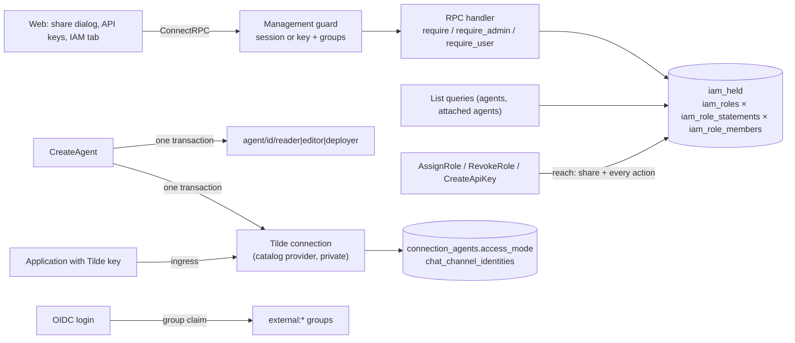

# Management authorization with roles, sharing UI and the Tilde provider as a connection

PR: https://github.com/trytilde/tilde/pull/10

## Intent of the change

Every management caller used to have full authority over every agent. Installations need
to decide who may view, change and deploy an agent, share it with people and groups, and
give automation keys a bounded reach. This change adds role-based authorization to the
control plane, a share dialog and a role-based API key page, groups mirrored from the
identity provider, and it remodels the built-in Tilde chat provider as an ordinary
catalog provider so its access policy and identities use the same tables, RPCs and UI as
every other chat provider.

Resulting behaviour: a role is a named set of actions (`view`, `edit`, `deploy`, `share`)
on one agent or on every agent. Each agent is created with three system roles, reader,
editor and deployer, which cannot be edited; users, groups and API keys hold any number of
them. Assigning a role needs `share` on the agent and every action the role gives, so
editors hand out reader and editor, deployers reader and deployer, and administrators
anything, including the installation-wide roles over every agent. Agents a caller cannot
view are not found. Connections and identities carry no roles. The agent runtime listener
is untouched: it still takes only the agent's invocation or deployment token.

## Architecture changes

Governing record: [ADR-0009 management authorization by roles](../adrs/0009-management-resource-authorization.md)
(new; amends [ADR-0003](../adrs/0003-deployment-authentication.md)). The decisions it
records: independent actions bundled by stored roles rather than an ordered plane or a
single action per grant; one statement table, one membership table and one SQL function
`iam_held` for point checks and list filters; reach as the sharing rule; no central policy
table (each RPC applies its own rule and a test drives every declared RPC through the
guard); connections outside authorization; API keys as principals holding roles. The
Tilde provider remodel records no new decision: it moves the provider onto the existing
connection and channel-access model.

## Summarized changes

- `crates/tilde/src/iam`: `authz.rs` (kinds, actions, system roles, `Access`, `Authz`
  with `require_reach`, `create_roles`, `require`/`require_admin`/`require_user`),
  `db.rs`, `service.rs` (IamService: users, groups, roles, assignments), `api_keys.rs`
  (keys hold roles), `oidc.rs` (guard authenticates only; login mirrors `external:`
  groups; the first user of an empty installation becomes an administrator). The policy
  table and the module README are gone.
- Every management RPC module applies its rule inline: `agent/rpc`, `deployment/rpc`,
  `connections/rpc` (connections need only a signed-in caller; attaching one needs edit
  on the agent), `identities/rpc`, `inference/rpc`, `chat/access/rpc`, `tracing/viewer`,
  `logs/viewer`, `chat/providers/tilde/management`.
- Tilde provider: `connections/catalog/tilde`, `chat/providers/tilde/adapter.rs`, a
  system-managed connection per agent created with the agent and backfilled at startup,
  application key as the connection credential, identities attested on first contact,
  generic access RPCs; the six Tilde-specific RPCs and their tables are removed.
- Migrations: `20260921100000_resource_authorization.sql` (users' email and name, groups,
  roles, statements, members, `iam_held`, seeds), `20260923100000_tilde_provider_connection.sql`
  (Tilde provider rows, drops `tilde_chat_keys`/`tilde_chat_identities`).
- Protos: `types/v1/authorization.proto` (Resource, Principal, Role, RoleAssignment),
  `management/v1/iam.proto` (roles and assignments RPCs, `GetGroup`), `api_keys.proto` (`role_ids`,
  `roles`), `tilde_chat.proto` (credentials only), `types/v1/access.proto`
  (`identities_attested`).
- Web: share popover with a descriptive multi-role menu anchored beneath each card, API
  key page with Agents and Manage agent deployments rows, IAM sidebar group (API keys,
  Groups), groups list opening a per-group page with paginated members, a chip-input
  Add users dialog and confirmed deletion, agent IAM tab without provider-specific
  branches, Tilde connection rendered from the generic list.
- Docs: README access section, CONTEXT.md IAM and Tilde sections, ADR-0009, two changie
  entries.

Validation run: `cargo fmt`, `cargo clippy -p tilde --tests` (clean apart from vendored
deprecations), `scripts/check-query-sites.sh`, `scripts/with-postgres.sh cargo test -p
tilde --no-fail-fast` (all binaries pass except the pre-existing `agent_avatar` test that
needs MinIO), `pnpm exec tsc --noEmit`, `pnpm exec vp check`, `pnpm exec vitest run`
(111 passed; the three failures are pre-existing: router keyboard navigation and two
agent-registry cases). Unverified: the SDK native-provider integration script against a
full node stack, and OIDC providers other than Dex.

## Critical to apply

yes

Apply the migrations before starting the new build; existing users become administrators
and existing API keys hold nothing until given roles. Development databases that applied
the withdrawn `20260922120000_tilde_chat_access` migration must drop that ledger row or
recreate the database. The management API changes shape: `IamService` replaces grant
RPCs with `ListRoles`, `ListRoleAssignments`, `AssignRole` and `RevokeRole`;
`CreateApiKey` takes `role_ids`; `TildeChatProviderService` keeps only credentials, and
Tilde access is managed through `AgentAccessService`. Set `ENGINE_OIDC_SCOPES` to include
the provider's groups scope and, optionally, `ENGINE_OIDC_ADMIN_GROUPS` or
`ENGINE_OIDC_ADMIN_SUBJECTS`; otherwise the first user to sign in administers.
