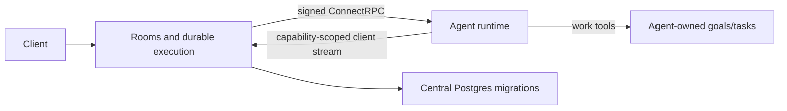

# Native Chat and ConnectRPC SDK

## Intent of the change

Port conversation/work primitives into the monolith and replace the hosted HTTP
chat endpoint with a ConnectRPC runtime and TypeScript SDK. Providers remain out
of scope while connections are implemented independently.

## Architecture changes

The new ADR records conversation-centric modeling, dynamic SDK tools, streaming
message completion, invocation capabilities, signed runtime calls and durable work.
No providers, inbox instances or generic event bus are introduced.

## Summarized changes

- Native room/user/participant/message/activity records and Connect APIs.
- Goals/tasks with scoped ownership, terminal lifecycle and dependencies.
- Runs/invocations with routing, steering, cancellation, leases and explicit resume.
- SDK pnpm workspace, generated contracts, and example agent.
- Real Rust/Node/Postgres integration coverage and Taskfile/CI integration.
- Validation passed: generated-contract comparison; SQLx metadata freshness against
  fresh Postgres; Rust formatting and focused Clippy; workspace Rust tests;
  existing JSON/Protobuf client checks; SDK build; real Rust/Node/Postgres tests;
  embedded-UI release build and the same integration test against that release
  binary; and SDK package creation including the license.
- SDK integration covers all room topologies, concurrent agents/rooms, partial and
  aborted streams, work ownership/dependencies, stop/resume, unconsumed steering,
  signed calls and cancellation. A Rust recovery test covers expired invocation
  state and its activity record before explicit resume.
- No external provider or hosted cloud deployment was exercised.

## Critical to apply

yes

Apply the central Chat migration and regenerate SQLx metadata and Protobuf
clients. Hosted agents use the ConnectRPC agent runtime service. Deploy
HTTP/2 on agent/callback paths and configure ENGINE_PUBLIC_URL when the listener
address is not reachable by agents. Existing agent signing keys remain required.
