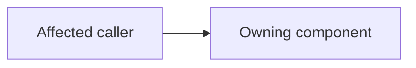

# Change title

PR: Pending

## Intent of the change

Describe the problem and resulting behavior for someone who has not read the task.

## Architecture changes

Link the governing/new ADRs, or state `ADR review: no new decision` and why.

Replace the diagram with this change's actual boundaries or documentation flow.

## Summarized changes

- Describe affected components and why they changed.
- Record focused validation actually run and its result.
- State unverified flows, related repository changes, and outstanding work.

## Critical to apply

no

Replace with `yes` when consumers/operators must act. Explain configuration,
migration, deployment order, compatibility, or why no action is required.
